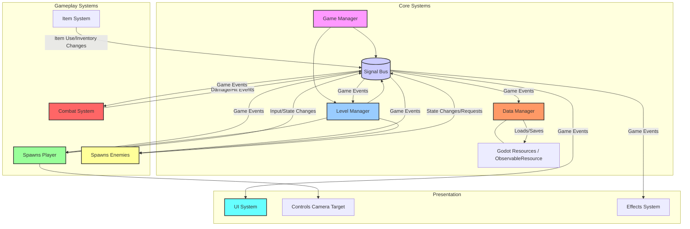

# Rogue Gauntlet Architecture

This document provides a high-level overview of the Rogue Gauntlet project structure and architecture, focusing on core concepts and component interactions. For implementation details, please refer directly to the source code.

## Core Architectural Principles

Rogue Gauntlet is built upon the following key principles:

- **Component-Based:** Game entities (Player, Enemies, Items, etc.) are constructed by composing Godot Nodes and attaching C# scripts (components) that define specific behaviors (e.g., Health, Movement, Combat). This promotes reusability and modularity.
- **Event-Driven:** Communication between different systems and components is primarily handled through a centralized `SignalBus`. This decouples systems, allowing them to react to game events without direct dependencies on each other (Observer pattern).
- **Scene-Oriented:** We leverage Godot's scene system extensively. Game objects, levels, and UI elements are organized as scenes, which can be easily instanced and managed within the scene tree.
- **Data-Oriented:** Game configuration, item definitions, and potentially other data are often stored using Godot's Resource system (`.tres` files) or custom C# classes like `ObservableResource` for easy editing and management.

## System Overview

The following diagram illustrates the major logical systems within Rogue Gauntlet and their primary communication pathways, often facilitated by the `SignalBus`.

## Key System Descriptions

- **Game Manager (`GameManager.cs`):** A singleton responsible for managing the overall game state (e.g., main menu, playing, game over), loading/transitioning between core game scenes, and potentially coordinating high-level game events.
- **Signal Bus (`SignalBus.cs`):** A central, singleton event bus. Systems emit signals (events) to the bus, and other systems subscribe to signals they care about, enabling decoupled communication.
- **Level Manager:** Handles the procedural generation or loading of game levels. Responsible for laying out rooms/corridors, placing environmental props, and spawning the player and enemies at appropriate locations. Often emits signals when level generation is complete.
- **Data Manager:** Manages the loading, saving, and access to game data, such as player progress, settings, or definitions stored in Godot Resources. May interact with the `SignalBus` to trigger saves or load data based on game events.
- **Player Controller:** Represents the player character. Manages player input, movement, interactions, and core stats. Typically composed of multiple components (e.g., `MovementComponent`, `HealthComponent`, `InventoryComponent`). Emits signals related to player actions or state changes.
- **Combat System:** Governs combat mechanics, including attack execution, damage calculation, hit detection (often using `HitBox`/`HurtBox` components), and status effect application (`Buffs`). Relies heavily on signals for initiating attacks and reporting outcomes.
- **Enemy AI:** Controls the behavior of non-player characters. This includes pathfinding (using Godot's navigation systems), decision-making (state machines), target selection, and triggering actions like movement or attacks. Interacts with the `CombatSystem` and `SignalBus`.
- **Item System:** Manages game items, including inventory, equipment, consumables, and their effects. Often uses Godot Resources to define item properties. Emits signals when items are used, picked up, or dropped.
- **UI System:** Responsible for displaying all user interface elements, such as the HUD, menus, inventory screens, and dialog boxes. Primarily reacts to signals from the `SignalBus` to update displayed information based on game state changes.
- **Camera System:** Controls the game camera's behavior, potentially following the player or other targets, framing action, or executing specific camera movements. May be influenced by player actions or game events.
- **Effects System:** Manages visual and audio effects, such as particle effects for attacks, sound effects for actions, or screen shakes. Often triggered by signals from other systems (e.g., `CombatSystem`).

## Directory Structure Overview

- `/scenes`: Contains Godot scene files (`.tscn`) representing game entities, levels, UI elements, and reusable component assemblies. Scenes often have a root node with attached C# scripts.
  - Subdirectories (`/player`, `/enemies`, `/items`, etc.) organize scenes by feature area.
- `/scripts`: Holds core C# script files (`.cs`), particularly singletons (`GameManager`, `SignalBus`), base classes, interfaces, and logic not directly tied to a specific scene node initially.
- `/common`: Contains reusable C# code, utility classes, interfaces, and base classes that are generally applicable across different parts of the project (e.g., `ObservableResource`).
- `/assets`: Stores all raw art, audio, 3D models, fonts, and other media files used by the game. Godot's import files (`.import`) will reside alongside them.
- `/addons`: Includes third-party plugins or extensions integrated into the project via Godot's addon system (e.g., Phantom Camera, Lines and Trails 3D).
- `/docs`: Contains supplementary documentation files, like this architecture overview, design notes, or diagrams.

## Contribution Guidelines

When adding new features or modifying existing ones:

- Adhere to the **Component-Based** principle: Build functionality by creating and composing reusable node scripts.
- Utilize the **Event-Driven** approach: Use the `SignalBus` for communication between decoupled systems. Avoid direct references where an event is more appropriate.
- Consult the `README.md` for project setup, coding standards, and the general contribution workflow.
- Keep this `ARCHITECTURE.md` updated if significant changes are made to the core structure or principles.
