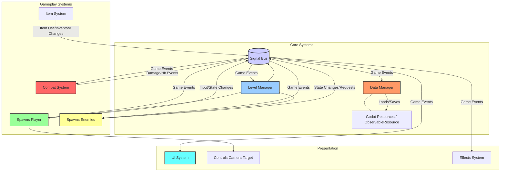

# Rogue Gauntlet Architecture

This document provides a high-level overview of the Rogue Gauntlet project structure and architecture, focusing on core concepts and component interactions. For implementation details, please refer directly to the source code.

## Core Architectural Principles

Rogue Gauntlet is built upon the following key principles:

- **Component-Based:** Game entities (Player, Enemies, Items, etc.) are constructed by composing Godot Nodes and attaching C# scripts (components) that define specific behaviors (e.g., Health, Movement, Combat). This promotes reusability and modularity.
- **Event-Driven:** Communication between different systems and components is primarily handled through a centralized `SignalBus`. This decouples systems, allowing them to react to game events without direct dependencies on each other (Observer pattern).
- **Scene-Oriented:** We leverage Godot's scene system extensively. Game objects, levels, and UI elements are organized as scenes, which can be easily instanced and managed within the scene tree.
- **Data-Oriented:** Game configuration and authored definitions are stored with Godot Resources (`.tres`) or custom C# resources such as `ObservableResource`. Runtime-mutated state should copy from authored defaults before play instead of writing back into shared definitions.

## System Overview

The following diagram illustrates the major logical systems within Rogue Gauntlet and their primary communication pathways, often facilitated by the `SignalBus`.

```mermaid
graph TD
    subgraph Core Systems
        SignalBus[(Signal Bus)]
        LevelManager[Level Manager]
        DataManager[Data Manager] --- Resource[Godot Resources / ObservableResource]
    end

    subgraph Gameplay Systems
        PlayerController[Player Controller]
        CombatSystem[Combat System]
        EnemyAI[Enemy AI]
        ItemSystem[Item System]
    end

    subgraph Presentation
        UISystem[UI System]
        CameraSystem[Camera System]
        EffectsSystem[Effects System]
    end

    %% Core Interactions
    LevelManager --> SignalBus
    DataManager -- Loads/Saves --> Resource

    %% Gameplay Interactions via SignalBus
    PlayerController -- Input/State Changes --> SignalBus
    CombatSystem -- Damage/Hit Events --> SignalBus
    EnemyAI -- State Changes/Requests --> SignalBus
    ItemSystem -- Item Use/Inventory Changes --> SignalBus

    %% Systems Reacting to SignalBus Events
    SignalBus -- Game Events --> UISystem
    SignalBus -- Game Events --> PlayerController
    SignalBus -- Game Events --> CombatSystem
    SignalBus -- Game Events --> EnemyAI
    SignalBus -- Game Events --> EffectsSystem
    SignalBus -- Game Events --> DataManager
    SignalBus -- Game Events --> LevelManager

    %% Direct Interactions (Examples)
    PlayerController --> CameraSystem[Controls Camera Target]
    LevelManager --> EnemyAI[Spawns Enemies]
    LevelManager --> PlayerController[Spawns Player]

    %% Style adjustments for clarity
    style SignalBus fill:#ccf,stroke:#333,stroke-width:2px
    style LevelManager fill:#9cf,stroke:#333,stroke-width:2px
    style DataManager fill:#f96,stroke:#333,stroke-width:2px
    style PlayerController fill:#9f9,stroke:#333,stroke-width:2px
    style CombatSystem fill:#f66,stroke:#333,stroke-width:2px
    style EnemyAI fill:#ff9,stroke:#333,stroke-width:2px
    style UISystem fill:#6ff,stroke:#333,stroke-width:2px
```

## Key System Descriptions

- **Signal Bus (`SignalBus.cs`):** A central, singleton event bus. Systems emit signals (events) to the bus, and other systems subscribe to signals they care about, enabling decoupled communication.
- **Game Flow:** Main menu, new-game, save-slot, or scene-transition orchestration should be introduced as a focused flow/session coordinator when those features exist, not as a generic gameplay registry.
- **Level Manager:** Handles the procedural generation or loading of game levels. Responsible for laying out rooms/corridors, placing environmental props, and spawning the player and enemies at appropriate locations. Often emits signals when level generation is complete.
- **Data Manager:** Manages the loading, saving, and access to game data, such as player progress, settings, or definitions stored in Godot Resources. May interact with the `SignalBus` to trigger saves or load data based on game events.
- **Player Controller:** The player root acts as a thin facade for its authored scene. Input, stats synchronization, inventory side effects, interactions, buffs, attacks, movement, health, and hit detection live in focused child components, with runtime player resources copied from authored defaults on spawn.
- **Combat System:** Governs combat mechanics, including attack execution, damage calculation, hit detection (often using attack nodes and `HurtBox` components), and status effect application (`Buffs`). Actor-specific controllers orchestrate authored attack nodes while shared attack components own reusable hit/projectile behavior.
- **Enemy AI:** Controls the behavior of non-player characters. Enemies are scene-composed actors with reusable behavior components and resource-driven behavior profiles for monster-specific tuning such as detection, roaming, attack ranges, and action timing. More specialized monsters should prefer new scenes/resources before adding global systems.
- **Item System:** Manages game items, including inventory, equipment, consumables, and their effects. Item resources define authored item behavior; inventory resources and item-slot resources are runtime state copied per player instance. Item events are emitted when items are used, equipped, picked up, dropped, or destroyed.
- **UI System:** Responsible for displaying all user interface elements, such as the HUD, menus, inventory screens, and dialog boxes. Primarily reacts to signals from the `SignalBus` to update displayed information based on game state changes.
- **Camera System:** Controls the game camera's behavior, potentially following the player or other targets, framing action, or executing specific camera movements. May be influenced by player actions or game events.
- **Effects System:** Manages visual and audio effects, such as particle effects for attacks, sound effects for actions, or screen shakes. Often triggered by signals from other systems (e.g., `CombatSystem`).

## Directory Structure Overview

- `/scenes`: Contains Godot scene files (`.tscn`) representing game entities, levels, UI elements, and reusable component assemblies. Scenes often have a root node with attached C# scripts.
  - Subdirectories (`/player`, `/enemies`, `/items`, etc.) organize scenes by feature area.
- `/scripts`: Holds core C# script files (`.cs`), particularly singleton/event infrastructure such as `SignalBus`, base classes, interfaces, and logic not directly tied to a specific scene node initially.
- `/common`: Contains reusable C# code, utility classes, interfaces, and base classes that are generally applicable across different parts of the project (e.g., `ObservableResource`).
- `/assets`: Stores all raw art, audio, 3D models, fonts, and other media files used by the game. Godot's import files (`.import`) will reside alongside them.
- `/addons`: Includes third-party plugins or extensions integrated into the project via Godot's addon system (e.g., Phantom Camera, Lines and Trails 3D).
- `/docs`: Contains supplementary documentation files, like this architecture overview, design notes, or diagrams.

## Contribution Guidelines

When adding new features or modifying existing ones:

- Adhere to the **Component-Based** principle: Build functionality by creating and composing reusable node scripts.
- Utilize the **Event-Driven** approach: Use the `SignalBus` for communication between decoupled systems. Avoid direct references where an event is more appropriate.
- Consult the `README.md` for project setup, coding standards, and the general contribution workflow.
- Keep this `ARCHITECTURE.md` updated if significant changes are made to the core structure or principles.
