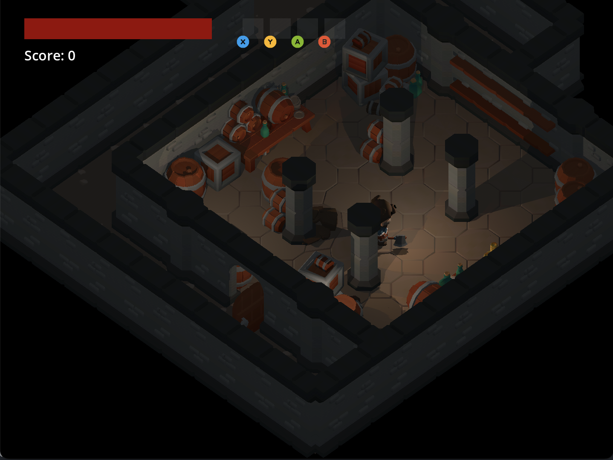
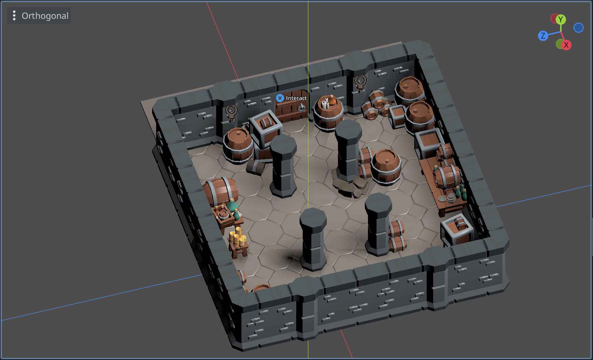
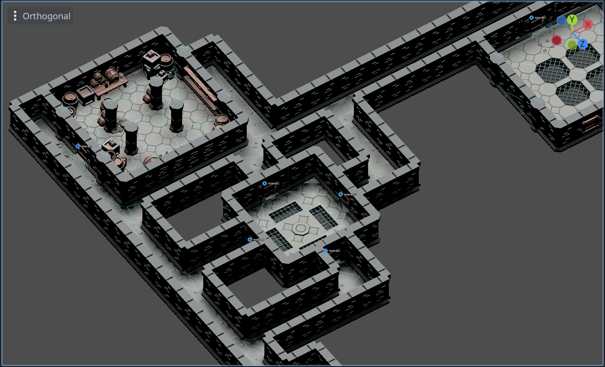

# ⚔️ Rogue Gauntlet

Rogue Gauntlet is a roguelike game built with C# in the Godot game engine. The game is inspired by classic roguelikes such as NetHack as well as Gauntlet, a classic arcade game.

Currently, this project is in the early stages of development. The game is not yet playable, but the basic mechanics are in place. The game is being developed as a learning project to improve my skills with C# and the Godot game engine. It is also a fun way to explore game development and design.

## Screenshots

## How To Run

To run the game, you will need to have the Godot Engine with .NET installed. You can download the engine from the [Godot website](https://godotengine.org/).

Once you have the engine installed, you can open the project by selecting the `project.godot` file in the root directory of the project and run the default scene.

## Getting Started with Development

Interested in contributing or understanding the codebase? Here's a quick guide:

### Prerequisites

- **Godot Engine (v4.x with .NET support):** Download from the [Godot website](https://godotengine.org/). Ensure you select the .NET version.
- **C# IDE:** A compatible IDE like Visual Studio Code (with C# extensions), JetBrains Rider, or Visual Studio is recommended for editing C# scripts.

### Building the Project

Godot typically handles C# compilation automatically when you run the project from the editor. If you need to build manually (e.g., for CI/CD or checking for errors), you can usually run `dotnet build` in the project's root directory from your terminal.

### Key Concepts & Structure

The project follows a few core principles:

- **Component-Based Design:** Functionality is built using Godot Nodes and attached C# scripts (components).
- **Event-Driven Communication:** Systems communicate primarily through a central `SignalBus`.

Key directories include:

- `/scenes`: Contains Godot scene files (`.tscn`).
- `/scripts`: Holds core C# logic, singletons, and base classes.
- `/assets`: Stores art, sound, models, etc.

For a detailed explanation of the architecture, core systems, design patterns, and a full directory breakdown, please refer to the **[ARCHITECTURE.md](./ARCHITECTURE.md)** file.

### Basic Workflow

A typical workflow for adding a new feature might involve:

1.  Creating or modifying scenes in `/scenes`.
2.  Writing or updating C# component scripts in `/scripts` or alongside scenes.
3.  Connecting components and systems using the `SignalBus` where appropriate.
4.  Testing the changes within the Godot editor.

### Coding Conventions

Please adhere to the coding style defined in the `.editorconfig` file. C# code generally follows standard .NET conventions. Refer to the `.clinerules` file and the contribution guidelines in **[ARCHITECTURE.md](./ARCHITECTURE.md)** for any project-specific rules.

## Architecture

See the [ARCHITECTURE.md](./ARCHITECTURE.md) file for an overview of the project structure and architecture.

## Requests and Suggestions

### Features

If you have a feature request, please open an issue with the `feature` label.

### Suggestions

If you have a suggestion for the game, open an issue with the `suggestion` label.

## Contributing

Contributions are welcome! Before submitting changes, please:

1.  Review the **[Getting Started with Development](#getting-started-with-development)** section above.
2.  Familiarize yourself with the project structure outlined in **[ARCHITECTURE.md](./ARCHITECTURE.md)**.
3.  Open an issue to discuss significant changes or submit a pull request for improvements.

Give a ⭐️ if you like this project!

## License

Rogue Gauntlet is distributed under the Apache 2.0 license with Commons Clause. It is free to use for personal or commercial projects, but you may not resell the software as-is without substantial modifications. See [LICENSE](LICENSE) for details.
