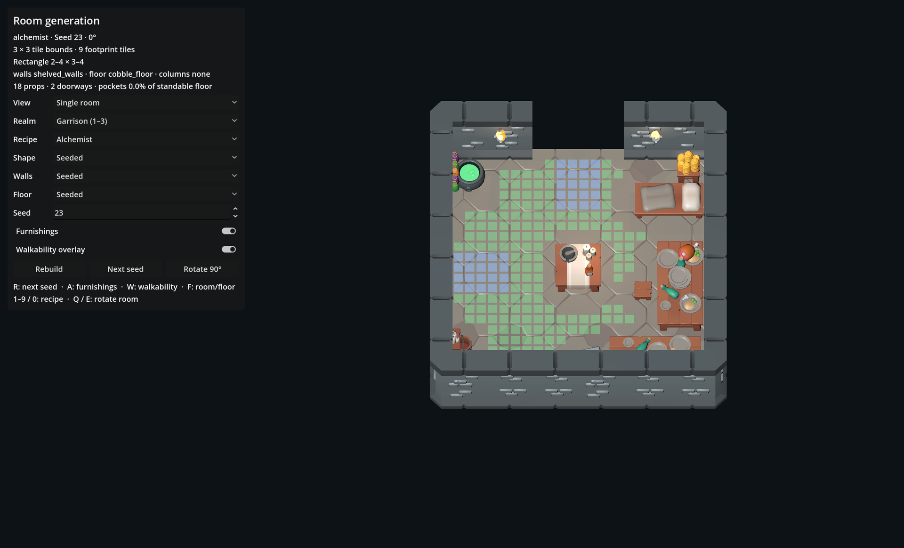
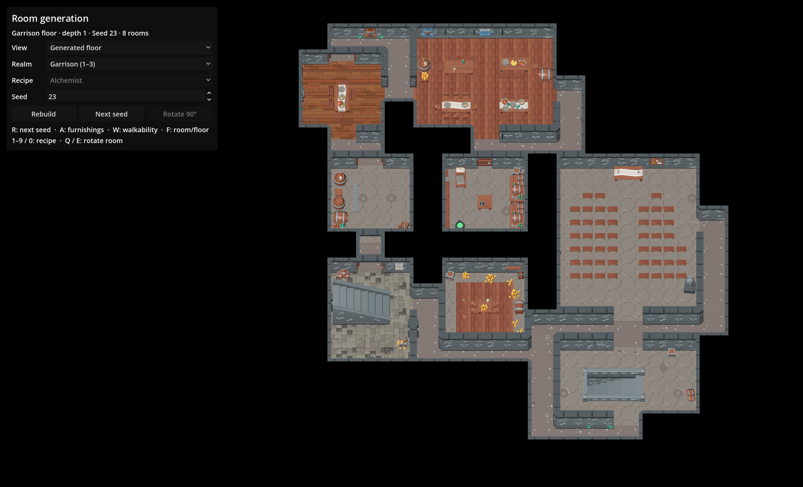
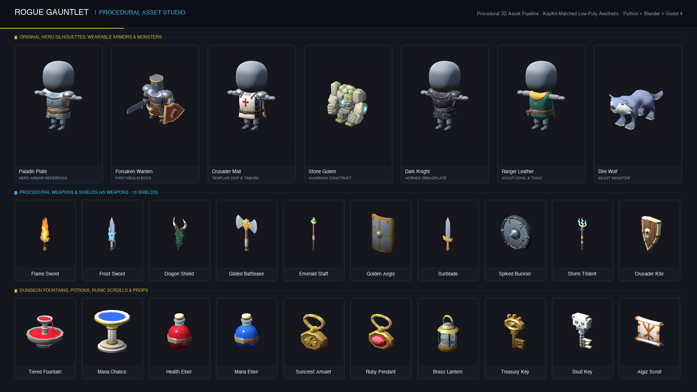

# ⚔️ Rogue Gauntlet

**Rogue Gauntlet** (working title) is an open-source 3D dungeon crawler built with **Godot 4** and **C#**.

https://github.com/user-attachments/assets/9e1bdc7e-e2ca-4c5b-8c15-7ea728996856

The project brings the spirit of classic dungeon crawlers like *Rogue* and *Gauntlet* into a modern 3D game with approachable, easy-to-pick-up mechanics and rich environments. It is not aiming for AAA scope or cinematic bloat. The focus is on the core roguelike loop:
- Finding loot and identifying unknown equipment
- Managing scarce resources (health, mana, food, keys, inventory space)
- Slaying monsters in real-time tactical combat
- Descending deeper into procedural dungeon floors
- Repeating runs with lessons learned

As a solo developer handling gameplay code, engine architecture, and 3D art, this project is heavily AI-assisted—both in code development and through a custom procedural asset pipeline.

---

## Procedural Level & Room Generation

Dungeons are generated procedurally at runtime. Individual rooms and full floor layouts are constructed algorithmically across configurable architectural themes.

### Dynamic Room Assembly
Rooms are assembled using modular strategies instead of fixed prefabs:
- **Room Architecture:** Geometry is generated from parameterized footprints (rectangles, L-, T-, U- and cross shapes) with columns, arches, and doorways the room owns.
- **Furnishing & Prop Placement:** Props and furnishings (tables, containers, light sources, obstacles) are placed by authored room types (e.g., library, crypt, alchemist, nave, smelter).
- **Walkability Validation:** Circulation paths and collision bounds are checked during assembly to guarantee clear paths between doorways, stairs, and interactive objects.



### Floor Layout & Progression
The floor generator places rooms, connects them with corridors, and handles progression dependencies:
- **Realms:** Five realms of five floors each (Garrison, Prison, Sewer, Mines, Cathedral) choose their floor plans, room pools, corridor tiles, motifs and monsters; each ends on a gatekeeper floor.
- **Floor Plans:** Weighted floor profiles lay rooms out as packed clusters, hallways, prison blocks, cathedral naves, cloisters, mines or labyrinths, then connect them with corridors that resolve wall junctions, corners, and doorway frames.
- **Lock & Key Gating:** Validated lock-and-key pairs (locked rooms, the labyrinth's key chains) and room-owned secret doors control access while keeping each floor solvable.
- **Traps:** Hidden pressure plates fire spikes, darts or fireballs; visible wall spouts and pendulum blades form timed gauntlet rooms.
- **Navigation & Spawns:** A clearance grid built from the floor's collision drives size-aware monster chasing, fleeing and routing through door gates, followed by threat-budgeted monster and loot placement.



---

## Project Status

The game is in active development. All five realms generate and play; balance and pacing are tuned for the first realm.

- **Working title:** *"Rogue Gauntlet"* is an unfinished working title and subject to change as the game's identity evolves.
- **Currently playable:** Procedural floors across five realms, real-time melee and magic combat (attacks, guard/parry, dodge), monsters with distinct movement and attacks, gatekeepers ending the Garrison, Prison and Sewer, traps and gauntlets, inventory, equipment, food/potions/scrolls, item identification, a merchant on the first floor of every later realm, fog of war and a floor map, delta saves on floor arrival and exit, and permadeath.
- **Still needed:** Balance beyond the first realm, the remaining Mines and Cathedral monsters and gatekeepers, a victory at the final depth, audio, and more 3D assets.

The repository is ready to clone, build, and run today.

---

## Visual Style & Custom Asset Pipeline

Rogue Gauntlet uses the low-poly, chunky stylized aesthetic popularized by **Kay Lousberg** in the [KayKit](https://kaykit.nl/) asset packs.



### Why a custom asset pipeline?
KayKit provides great free starter assets, but extended packs and specific items are paid or Patreon-exclusive. Because this is an open-source project under a permissive license, commercial and Patreon-gated assets cannot be committed to the repository.

To solve this as a solo developer, I built **[Asset Studio](asset-studio/README.md)**. The [Orc Warrior](asset-studio/characters/orc/orc_warrior/README.md) shows how we take approved concept art through image-to-3D, Blender, and Godot. We use that workflow for new characters and wearable armor, and use Python recipes for food, potions, weapons, and props. Both routes follow KayKit's proportions, bevels, and palette gradients.

> [!TIP]
> ### Support Kay Lousberg on Patreon
> If you like this art style or use these assets in your own projects, consider becoming a patron of [Kay Lousberg on Patreon](https://www.patreon.com/kaylousberg) or purchasing packs on [itch.io](https://kaylousberg.itch.io/).

---

## Project Architecture & Godot Best Practices

This project is intended for learning best practices in Godot 4 and C# as much as it is to create a playable game. It provides a real-world reference for structuring a medium-sized C# codebase in Godot without monolithic node hierarchies or entangled dependencies.

### Repository Structure

```
rogue-gauntlet/
├── scenes/             # Godot scenes (.tscn), .tres resources, and component scripts
│   ├── player/         # Hero scene, components and classes
│   ├── enemies/        # Monster families, actions and AI
│   ├── attacks/        # Attack definitions, animation profiles, and hitboxes
│   ├── magic/          # Spell definitions and effects
│   ├── items/          # Item definitions, drop presets, and grip transforms
│   ├── levels/         # Level generation, realms, room types, assembly steps, and encounters
│   ├── props/          # Doors, chests, traps, triggers and furnishings
│   ├── debug/          # Combat, room and map harnesses and effect previews
│   └── ui/             # HUD, run menu, front end, and the debug menu
├── scripts/            # Autoloads (GameSession, SignalBus, ScenePool), save codecs, balance simulator
├── common/             # Shared C# infrastructure, ObservableResource, interfaces
├── asset-studio/       # Blender character sources, item recipes, and art catalogs
├── assets/             # Game-ready 3D models (.glb), textures, audio, and materials
├── docs/               # Game design document, roadmap, specs, and system guides
└── tests/              # GdUnit4 automated test suites (unit tests & runtime tests)
```

### Core Architecture Patterns

1. **Composition over Inheritance:** Actors (`Player`, `EnemyBase`) are thin facades composed of modular `[GlobalClass]` Node components (`HealthComponent`, `MovementComponent`, `HurtBoxComponent`, `ActionGate`, `InventoryController`).
2. **Strategy Pattern via Godot Resources:** Behaviors that vary—such as room assembly rules, lock mechanisms, enemy tactics, and consumable effects—are authored as stateless `[GlobalClass] Resource` strategies (`.tres`). Authored definitions remain immutable; runtime state is explicitly cloned on spawn.
3. **Editor-First `[Export]` Authoring:** Tunable attributes, actor states, and node/resource dependencies are exposed as `[Export]` properties with reactive setters (`if (!IsNodeReady()) return;`), making systems inspectable and editable in the Godot Inspector.
4. **Three-Tier Notification Model:**
   - **Local component signals (`[Signal]`):** Parent-child and sibling communication within an actor scene.
   - **Observable Resources (`ObservableResource`):** Mutated runtime resources emit `Resource.Changed` for data binding.
   - **Decoupled Cross-System Broadcasts (`SignalBus`):** Global events (room transitions, combat XP, loot discoveries) route through a central event bus, subscribed via `this.SubscribeUntilExit(...)` to prevent dangling handlers.
5. **Seeded Determinism & Delta Persistence:** Untouched dungeon levels generate deterministically from the run seed and isolated RNG streams. Saved games persist only player state and floor deviations (opened doors, looted items, discovered fog of war), keeping save files lean.

See **[ARCHITECTURE.md](./ARCHITECTURE.md)** for detailed system diagrams and engine interaction details.

---

## Getting Started

### Prerequisites
- **[Godot Engine 4.x (.NET edition)](https://godotengine.org/):** Ensure you download the .NET-enabled version of Godot.
- **[.NET SDK (9.0 or later)](https://dotnet.microsoft.com/download):** Required for building C# solutions.
- **IDE:** Visual Studio Code (with C# Dev Kit), JetBrains Rider, or Visual Studio.

### Building & Running

1. **Clone the repository:**
   ```bash
   git clone https://github.com/arabold/rogue-gauntlet.git
   cd rogue-gauntlet
   ```
2. **Build the C# solution:**
   ```bash
   dotnet build "Rogue Gauntlet.sln"
   ```
3. **Open and Run:**
   - Launch Godot, import `project.godot`, and press **F5** to play the main menu scene (`res://scenes/menu/main_menu.tscn`).
   - Or open `res://scenes/main/main.tscn` directly with **F6** to jump straight into dungeon generation and gameplay.

### Running Tests
Tests use **GdUnit4** and run against a real headless Godot runtime in simulated time (a fixed 60 frames per game second, as fast as the machine allows):
```bash
export GODOT_BIN="/Applications/Godot_mono.app/Contents/MacOS/Godot" # Adjust to your local Godot binary path
dotnet test "Rogue Gauntlet.csproj" --settings .runsettings
```
[AGENTS.md](AGENTS.md#testing) covers the test conventions.

---

## Controls

The game is playable with keyboard or gamepad (Xbox labels). In menus the gamepad uses `A` to accept, `B` to go back, `LB` / `RB` to switch tabs, `X` for the alternate action and `Y` to drop.

| Action | Keyboard | Gamepad |
| :--- | :--- | :--- |
| **Move** | `W` / `A` / `S` / `D` or Arrow Keys | Left Stick (tilt to walk) |
| **Walk** | Hold `Shift` | — |
| **Primary Action** (Basic Attack / Wand Volley) | `J` | `A` |
| **Secondary Action** (Heavy Technique / Bound Spell) | `K` | `X` |
| **Off-hand Action** (Guard & Parry / Off-hand Attack) | `L` (hold to guard) | `Y` (hold to guard) |
| **Dodge** | `Space` | `B` |
| **Interact** (Doors, Chests, Fountains) | `E` (hold to interact) | `RB` (hold to interact) |
| **Item Quick Slots 1–4** | `1`, `2`, `3`, `4` | D-pad Up, Right, Down, Left |
| **Run Menu: Gear** (equipment and pack) | `I` | `Menu` (Start) |
| **Run Menu: System** (pause and settings) | `Esc` | `View` (Back) |
| **Floor Map** | Hold `Tab` | Hold `LB` |
| **Rotate Camera** | `,` / `.` | Right Stick left / right |
| **Zoom Camera** | `'` / `/` | Right Stick up / down |

---

## Documentation & Learning Resources

Explore the design and technical documentation in the [`docs/`](docs/) directory:

- **[ARCHITECTURE.md](./ARCHITECTURE.md):** Architectural principles, component diagrams, and coding standards.
- **[Game Design Document](docs/game-design.md):** Vision, core mechanics, and gameplay systems.
- **[Development Roadmap](docs/development-roadmap.md):** Milestone targets, deliverables, and acceptance criteria.
- **[Level Generation & Design](docs/level-design.md):** Room assembly, doorway-driven connectivity, monster navigation, and fog of war.
- **[Combat System](docs/combat-system.md):** Action gating, contact timing, hurtboxes, poise, and parry mechanics.
- **[Stats & Itemization](docs/stats-and-itemization.md):** Equipment tiers, modifiers, item identification, and persistence.
- **[Asset Studio Guide](asset-studio/README.md)** covers character, wearable, item, and prop authoring.
- **[Documentation Index](docs/README.md):** Full catalog of technical specs, harness guides, and design docs.

---

## Contributing

Contributions, ideas, bug reports, and discussions are welcome! Areas of interest include:
- Balancing combat and tuning progression
- Designing new dungeon room types or trap mechanics
- Expanding monster AI tactical behaviors
- Improving 3D assets or procedural shader effects
- Writing tests or refining C# architecture patterns

Feel free to open an issue or submit a pull request. Check out the [Getting Started](#getting-started) section and [ARCHITECTURE.md](./ARCHITECTURE.md) before submitting major code changes.

Give a ⭐️ on GitHub if you find the project interesting or helpful for your own Godot journey!

---

## License

Rogue Gauntlet is distributed under the **Apache 2.0 license with Commons Clause**. It is free to use, modify, and study for personal or commercial projects, but you may not resell the software as-is without substantial modifications. See [LICENSE](LICENSE) for full details.
