# Item Catalog

Visual + data reference for every item definition in the game — the itemization counterpart to the [monster catalog](../monster-catalog/README.md). Renders are generated from each item's actual world model (the same one shown in the inventory preview and dropped in the world) by `.agents/skills/assets/scripts/render_item_catalog.gd` — see the `assets` skill. Each row maps to its `.tres` definition under `scenes/items/`.

> `Tier` is the base item's ladder rung (1–5), independent of the `Rarity` an instance rolls when it drops — see `docs/stats-and-itemization.md`. Rows are grouped by tier for weapons/shields since that's the nominal dungeon-depth progression.

## Weapons

### Tier 1

| | Weapon | Hands | Damage | Str Req | Notes |
|---|---|---|---|---|---|
| 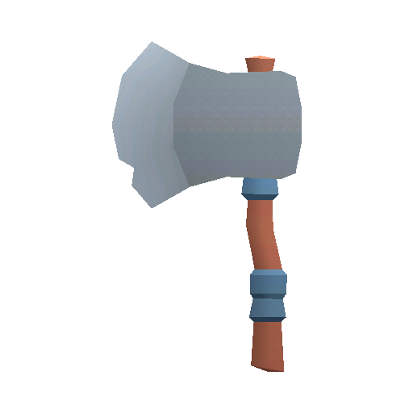 | **Axe** | 1H | 1–5 | 10 | — |
| 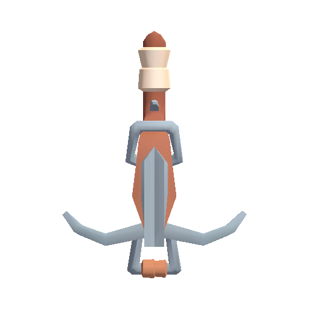 | **Crossbow** | 2H | 2–4 | 10 | Range 20 |
| 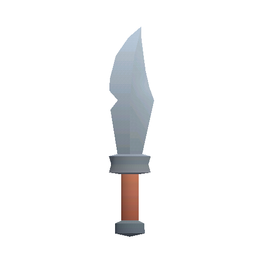 | **Dagger** | 1H | 1–4 | 10 | Acc ×1.2 |
| 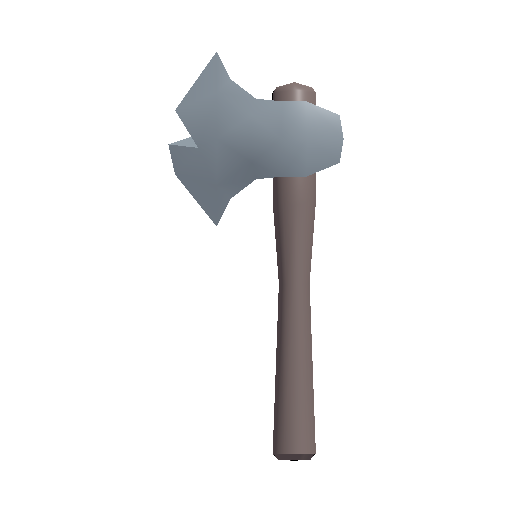 | **Old Axe** | 1H | 1–5 | 10 | — |
| 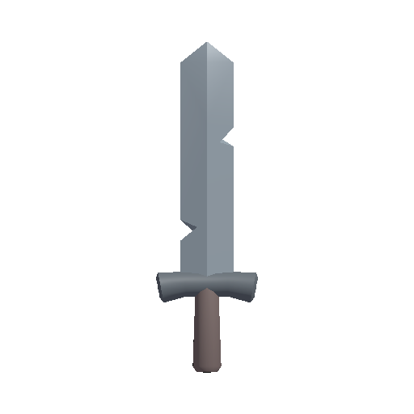 | **Shortsword** | 1H | 1–5 | 10 | — |
| 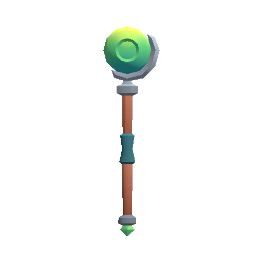 | **Staff** | 1H | 2–7 | 12 | — |
| 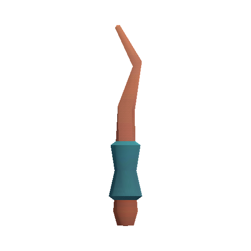 | **Wand** | 1H | 1–5 | 0 | — |

### Tier 2

| | Weapon | Hands | Damage | Str Req | Notes |
|---|---|---|---|---|---|
|  | **Air Staff** | 1H | 1–3 | 5 | Air, +3% crit, Acc ×1.15 |
| 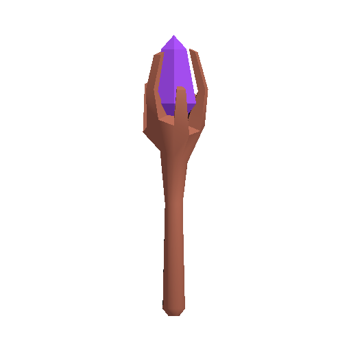 | **Ash Staff** | 1H | 4–9 | 8 | — |
| 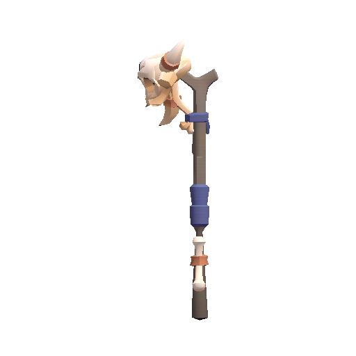 | **Earth Staff** | 1H | 3–6 | 8 | Earth, +8% crit, Acc ×0.9 |
|  | **Fire Staff** | 1H | 3–6 | 6 | Fire, +5% crit |
|  | **Frost Staff** | 1H | 2–4 | 6 | Water, +2% crit, Acc ×1.05 |
| 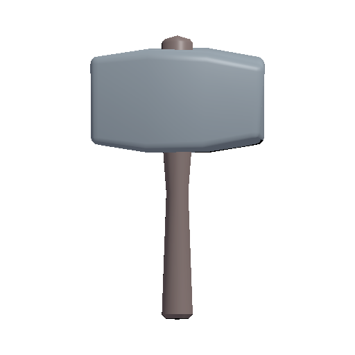 | **Hammer** | 1H | 3–8 | 12 | — |
| 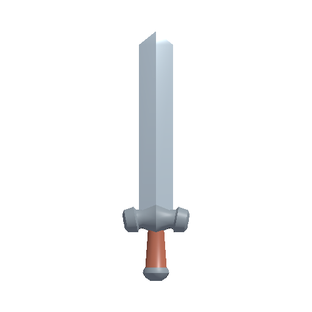 | **Longsword** | 1H | 3–8 | 10 | — |
| 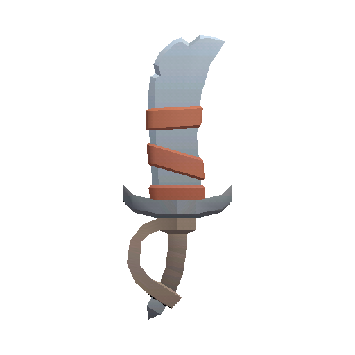 | **Old Saber** | 1H | 2–7 | 12 | — |
|  | **Skeleton Staff** | 1H | 2–7 | 12 | — |
| 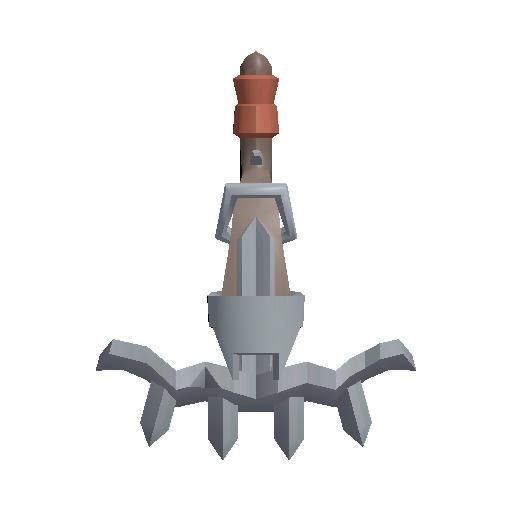 | **Spiked Crossbow** | 2H | 4–8 | 10 | Range 20 |
| 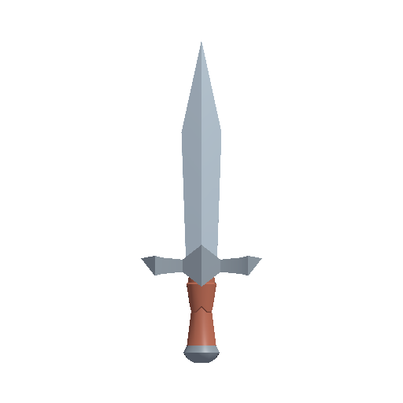 | **Stiletto** | 1H | 2–7 | 0 | +8% crit, Acc ×1.2 |
| 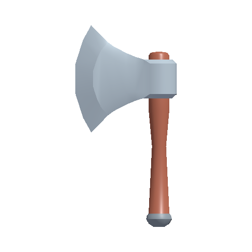 | **War Axe** | 1H | 3–9 | 12 | — |

### Tier 3

| | Weapon | Hands | Damage | Str Req | Notes |
|---|---|---|---|---|---|
| 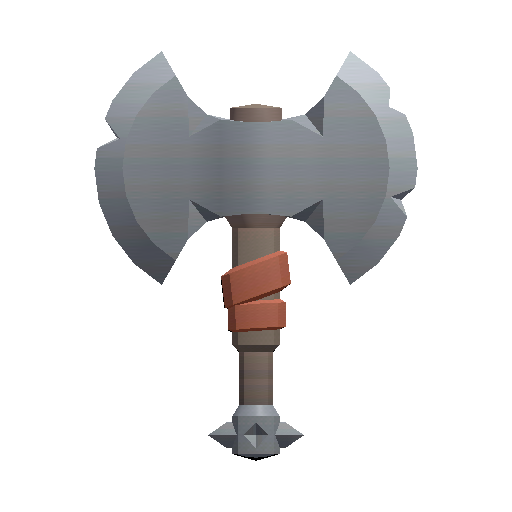 | **Battle Axe** | 2H | 6–12 | 14 | — |
| 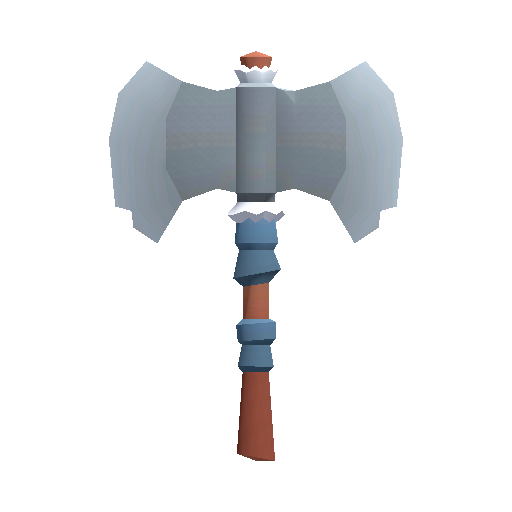 | **Battle Axe** | 2H | 6–12 | 14 | — |
| 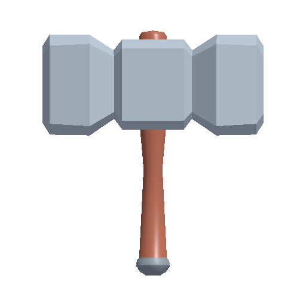 | **Battle Hammer** | 1H | 5–11 | 14 | — |
| 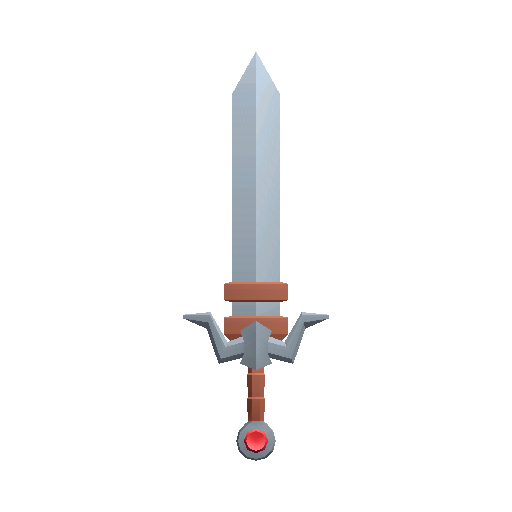 | **Broadsword** | 2H | 6–13 | 15 | — |
| 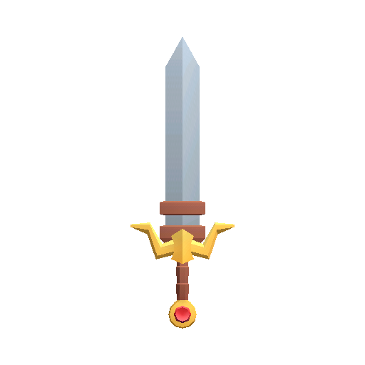 | **Broadsword** | 2H | 6–13 | 15 | — |
| 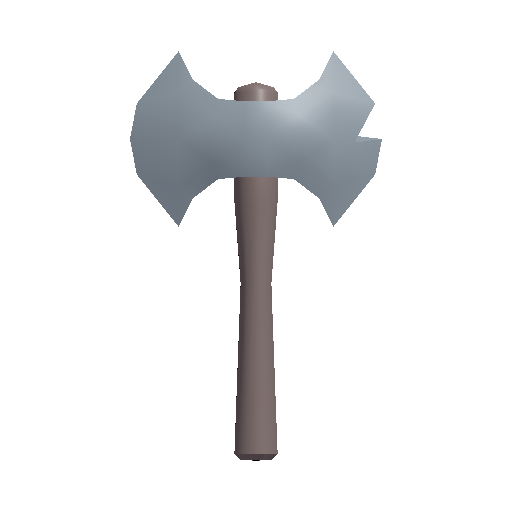 | **Double Axe** | 2H | 7–14 | 16 | — |
| 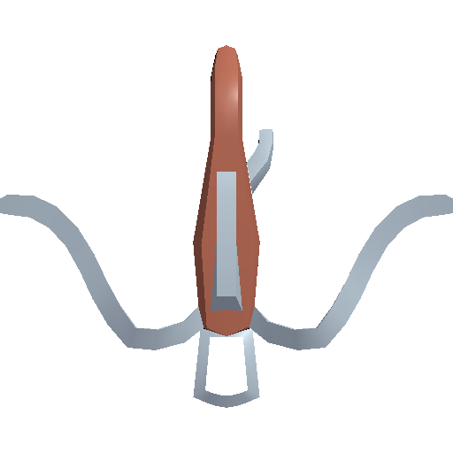 | **Heavy Crossbow** | 2H | 6–11 | 13 | Range 20 |
| 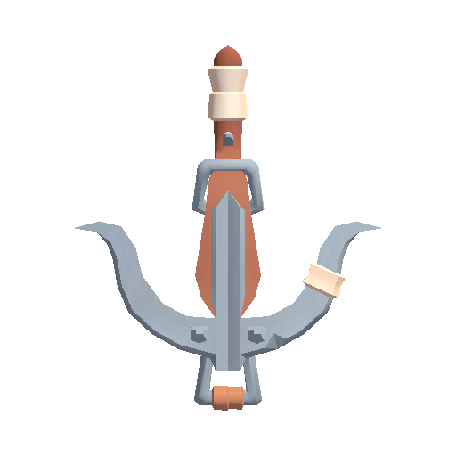 | **Large Crossbow** | 2H | 7–12 | 12 | Range 20 |

### Tier 4

| | Weapon | Hands | Damage | Str Req | Notes |
|---|---|---|---|---|---|
| 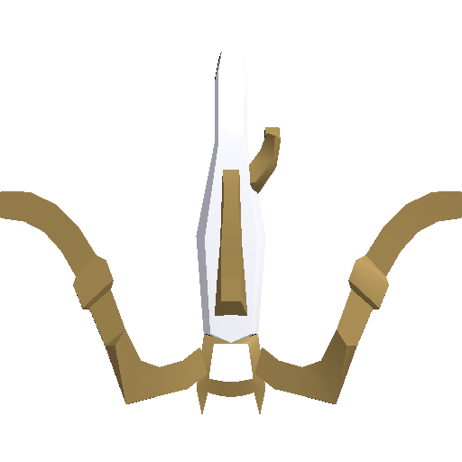 | **Arbalest** | 2H | 10–17 | 15 | Range 22 |
| 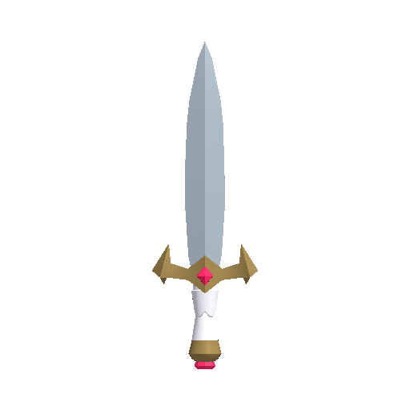 | **Assassin's Dagger** | 1H | 6–12 | 0 | +15% crit, Acc ×1.25 |
| 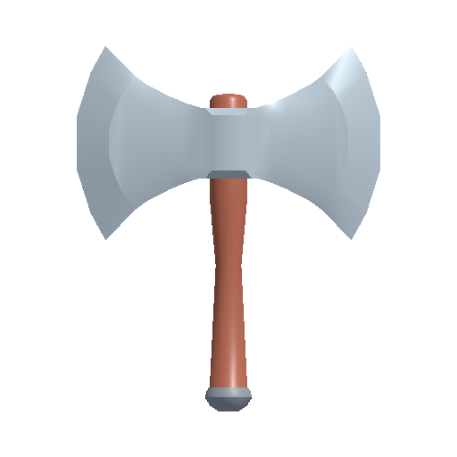 | **Great Axe** | 2H | 12–22 | 19 | — |
| 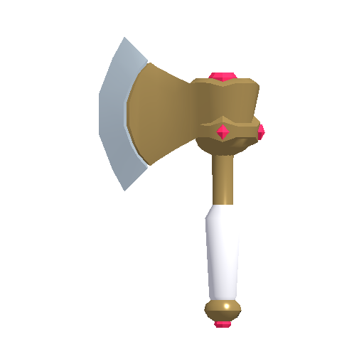 | **Royal Axe** | 1H | 9–17 | 17 | — |
| 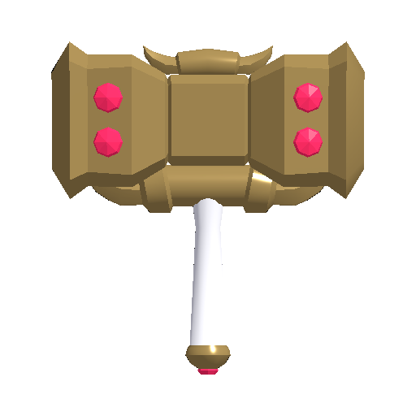 | **Royal Hammer** | 1H | 8–15 | 16 | — |
| 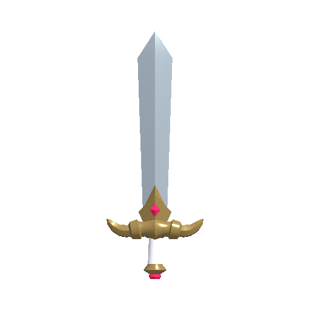 | **Royal Sword** | 1H | 8–16 | 15 | — |
| 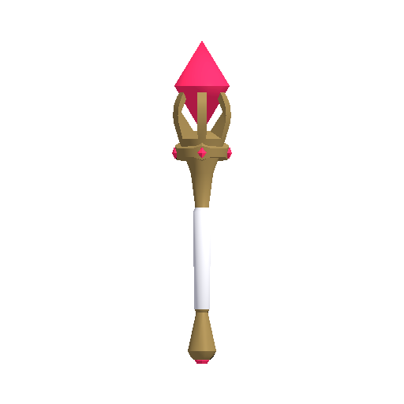 | **Rune Staff** | 1H | 9–16 | 10 | +3% crit |
| 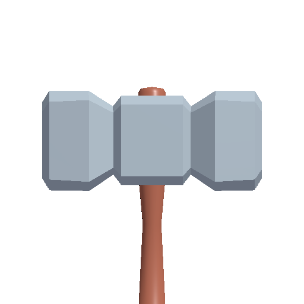 | **Warhammer** | 2H | 10–18 | 18 | — |

### Tier 5

| | Weapon | Hands | Damage | Str Req | Notes |
|---|---|---|---|---|---|
| 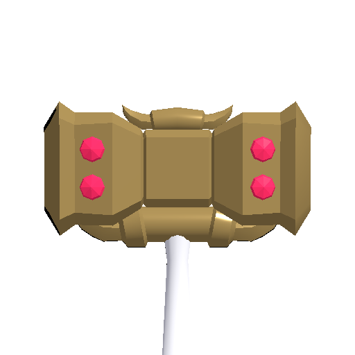 | **Gilded Warhammer** | 2H | 15–27 | 22 | — |
| 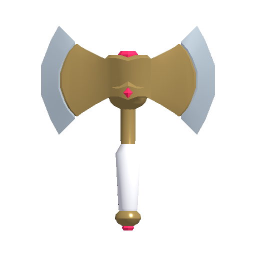 | **Royal Double Axe** | 2H | 16–30 | 23 | — |

## Shields

### Tier 1

| | Shield | Armor | Str Req | Speed |
|---|---|---|---|---|
|  | **Common Shield** | 3 | 10 | — |
| 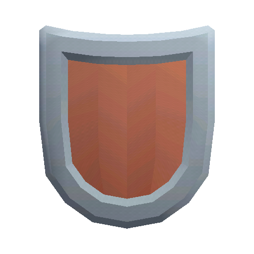 | **Common Shield** | 3 | 10 | — |
|  | **Round Shield** | 2 | 9 | — |
|  | **Round Shield** | 2 | 9 | — |
|  | **Round Shield** | 2 | 9 | — |
|  | **Round Shield** | 2 | 9 | — |
| 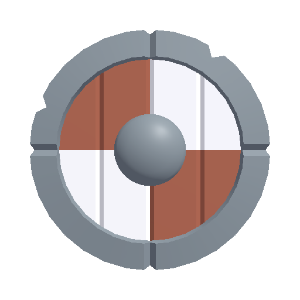 | **Wooden Shield** | 2 | 6 | — |

### Tier 2

| | Shield | Armor | Str Req | Speed |
|---|---|---|---|---|
|  | **Skull Shield** | 3 | 10 | — |
|  | **Spiked Shield** | 3 | 10 | — |
|  | **Spiked Shield** | 3 | 10 | — |
| 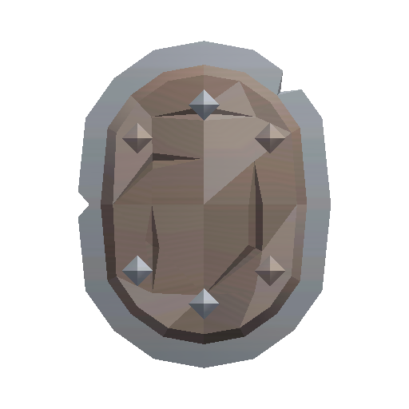 | **Spiked Shield** | 3 | 10 | — |
|  | **Square Shield** | 2 | 9 | — |
|  | **Square Shield** | 2 | 9 | — |

### Tier 3

| | Shield | Armor | Str Req | Speed |
|---|---|---|---|---|
| 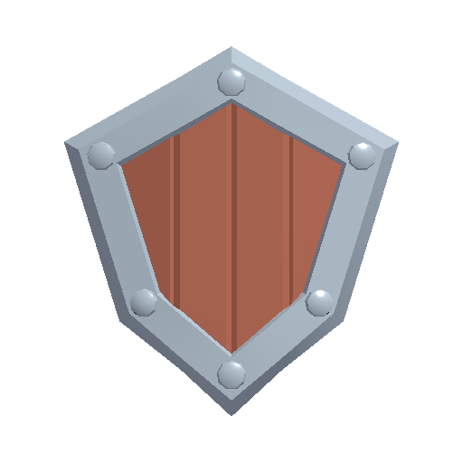 | **Reinforced Shield** | 5 | 12 | ×0.97 |

### Tier 4

| | Shield | Armor | Str Req | Speed |
|---|---|---|---|---|
|  | **Royal Shield** | 8 | 16 | ×0.95 |

## Potions

All potions carry a hidden identity — see `docs/item-identification-system.md`.

| | Potion | Effect | TypeId | Value |
|---|---|---|---|---|
|  | **Potion of Slowness** | Slowness: -50% Speed for 8s | `potion.slowness` | 30 |
|  | **Potion of Poison** | Poison: 6 damage over 6s | `potion.poison` | 40 |
| 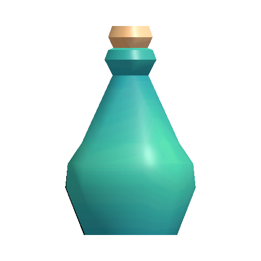 | **Potion of Healing** | Healing: 20 HP over 1s | `potion.healing` | 100 |
| 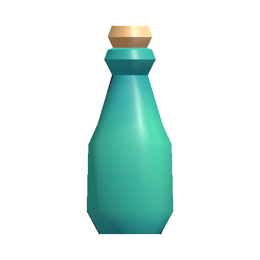 | **Potion of Healing** | Healing: 10 HP over 1s | `potion.healing` | 100 |
| 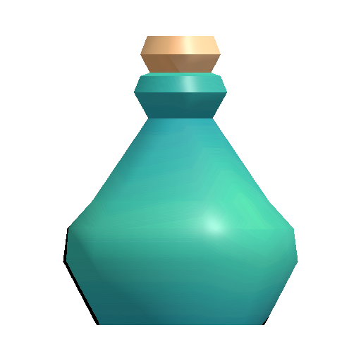 | **Potion of Healing** | Healing: 50 HP over 1s | `potion.healing` | 100 |
|  | **Potion of Haste** | Haste: +60% Speed for 15s | `potion.haste` | 120 |
|  | **Potion of Regeneration** | Regeneration: 20 HP over 10s | `potion.regeneration` | 150 |

## Scrolls

Scroll effects that aren't stat buffs are authored `ScrollEffect` strategies (identify, enchant, teleport, summon); the rest are plain buff/debuff scrolls, same as potions. "Target" scrolls open the inventory targeting mode when read.

| | Scroll | Effect | Target | TypeId | Value |
|---|---|---|---|---|---|
|  | **Scroll of Summoning** | Summons 3 enemies within 4u (BAD) | — | `scroll.summon` | 10 |
|  | **Scroll of Weakness** | Weakness: -4 Strength, -15% Speed for 45s | — | `scroll.weakness` | 20 |
|  | **Scroll of Identification** | Reveals a chosen item's true identity | Yes | `scroll.identify` | 80 |
|  | **Scroll of Haste** | Haste: +30% Speed for 30s | — | `scroll.haste` | 100 |
|  | **Scroll of Protection** | Protection: +8 Armor for 60s | — | `scroll.protection` | 110 |
|  | **Scroll of Rage** | Rage: +25% MinDamage, +25% MaxDamage for 30s | — | `scroll.rage` | 130 |
|  | **Scroll of Teleportation** | Relocates the player to a random free tile | — | `scroll.teleport` | 150 |
|  | **Scroll of Enchantment** | Bumps a chosen item's rarity + adds one affix | Yes | `scroll.enchant` | 200 |

## Jewelry

Rings and amulets carry a hidden identity like potions/scrolls, and show only a disguised name ("a jade ring") until worn or identified. World models are authored primitives (no ring/amulet art exists in any owned asset pack).

### Rings

| | Ring | Effect | TypeId | Value |
|---|---|---|---|---|
|  | **Ring of Lethargy** ⚠️ | -15% Speed | `ring.lethargy` | 40 |
|  | **Ring of Frailty** ⚠️ | -15 MaxHealth | `ring.frailty` | 40 |
|  | **Ring of Strength** | +2 Strength | `ring.strength` | 150 |
|  | **Ring of the Mind** | +2 Intelligence | `ring.mind` | 150 |
|  | **Ring of Dexterity** | +2 Dexterity | `ring.dexterity` | 150 |
|  | **Ring of Vitality** | +2 Vitality | `ring.vitality` | 150 |
|  | **Ring of Evasion** | +6 Evasion | `ring.evasion` | 160 |
|  | **Ring of Protection** | +4 Armor | `ring.protection` | 160 |
| 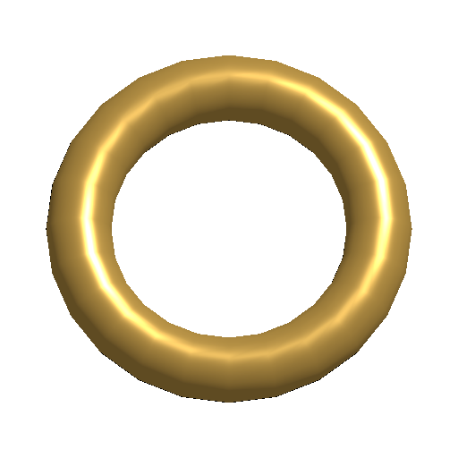 | **Ring of Precision** | +10% Accuracy | `ring.precision` | 160 |
|  | **Ring of Savagery** | +2 MinDamage, +3 MaxDamage | `ring.savagery` | 180 |

### Amulets

| | Amulet | Effect | TypeId | Value |
|---|---|---|---|---|
|  | **Amulet of Dread** ⚠️ | -10% MinDamage, -10% MaxDamage | `amulet.dread` | 50 |
|  | **Amulet of Swiftness** | +10% Speed | `amulet.swiftness` | 200 |
|  | **Amulet of Vigor** | +25 MaxHealth | `amulet.health` | 200 |
| 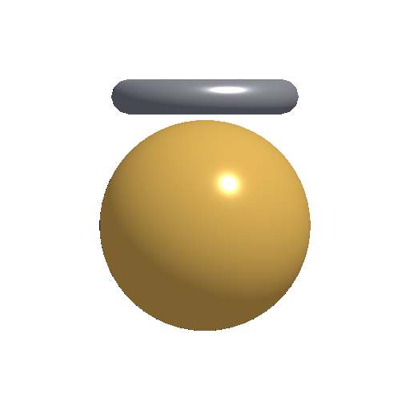 | **Amulet of the Titan** | +3 Strength, -4 Evasion | `amulet.titan` | 220 |

> ⚠️ marks intentionally cursed jewelry (a net-negative effect) — the risk/reward gamble of wearing an unidentified ring.

## Currency

| | Item | Notes |
|---|---|---|
| 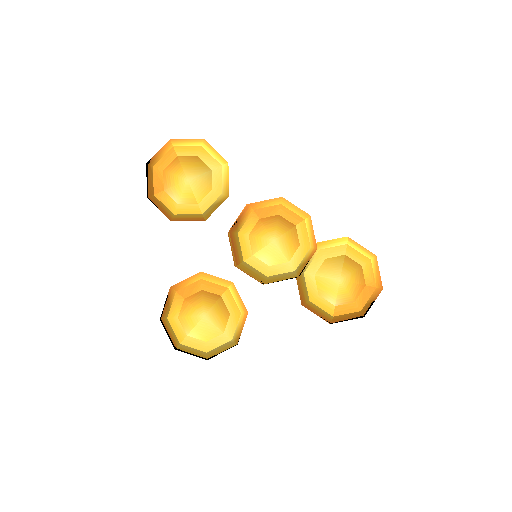 | **Gold** | Stackable; drop quantity scales with dungeon depth via `LootTableItem.QuantityPerDepth` |

> 37 weapons, 15 shields, 7 potions, 8 scrolls, 10 rings, 4 amulets, and gold — 82 item definitions total (excludes class-starter weapons, which aren't part of the loot ladder). Regenerate images after adding/removing items — see the command in `render_item_catalog.gd`'s header comment.
