# Monster Catalog

Visual reference for the full enemy bestiary — KayKit skeletons (CC0) and the Quaternius
"Ultimate Monsters" set (CC0). Renders are generated from the imported models by
`.agents/skills/assets/scripts/render_catalog.gd` — see the `assets` skill. Ordered roughly
weakest → toughest. Each row maps to its enemy scene under `scenes/enemies/`.

| | Monster | Type | HP | Role |
|---|---|---|---|---|
| 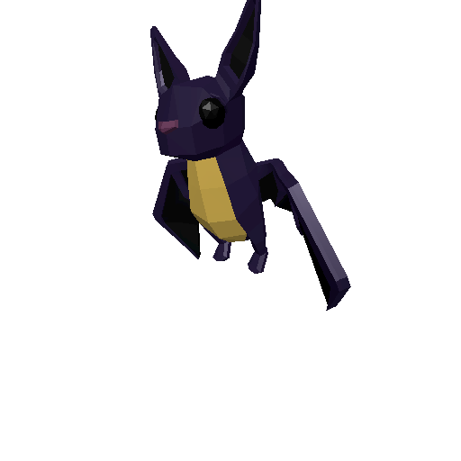 | **Bat** | Flyer | 4 | fast, dodgy swarm flyer |
| 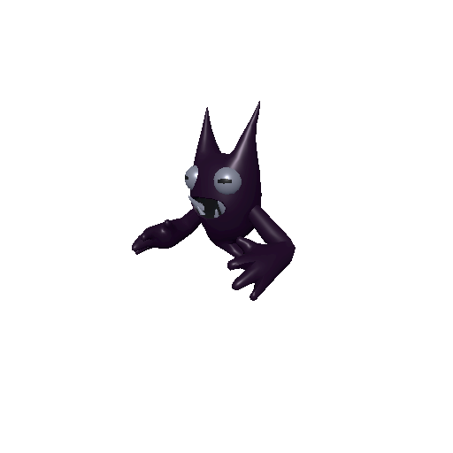 | **Ghost** | Flyer | 6 | evasive hovering harasser |
| 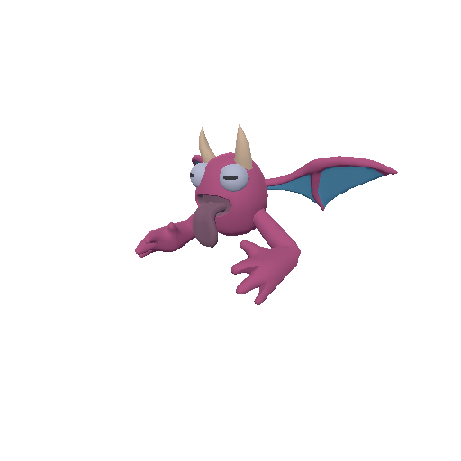 | **Squidle** | Flyer | 7 | eldritch floater |
| 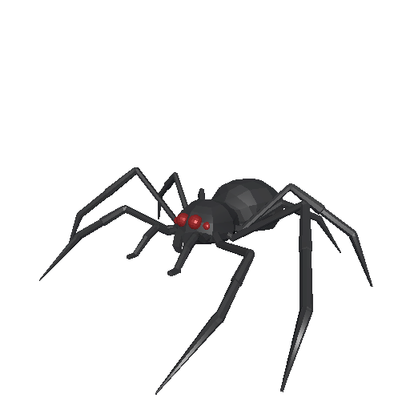 | **Spider** | Crawler | 7 | quick melee |
| 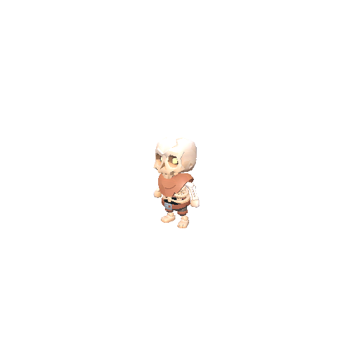 | **Skeleton Minion** | Undead | 8 | baseline undead melee |
| 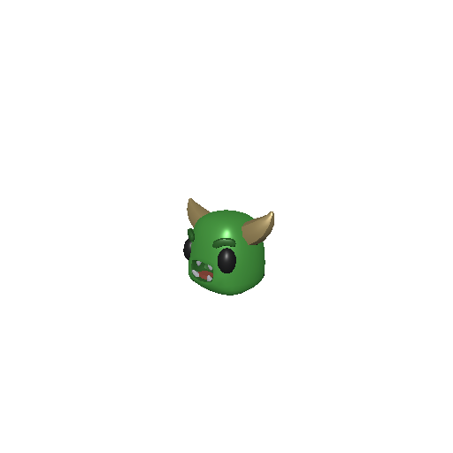 | **Slime** | Blob | 8 | slow chaser |
| 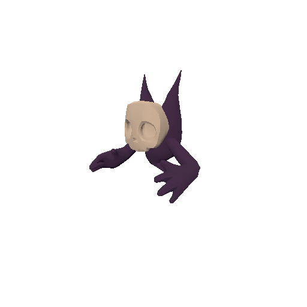 | **Ghost Skull** | Flyer | 8 | undead flyer |
| 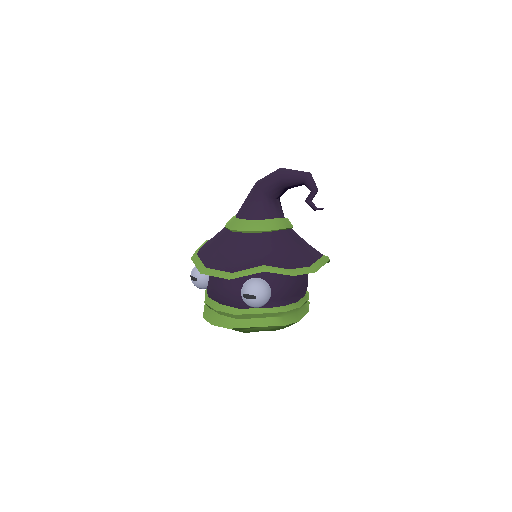 | **Wizard** | Caster | 8 | long detection range |
| 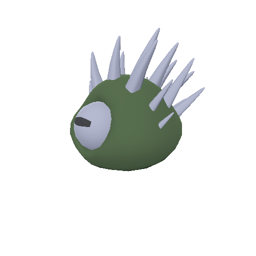 | **Spiky Blob** | Blob | 9 | spiky bruiser |
| 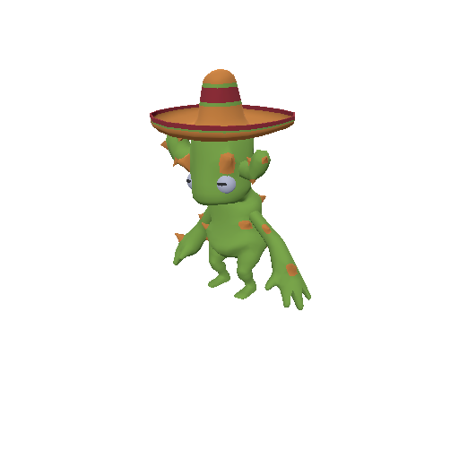 | **Cactoro** | Brute | 10 | spiky cactus brute |
| 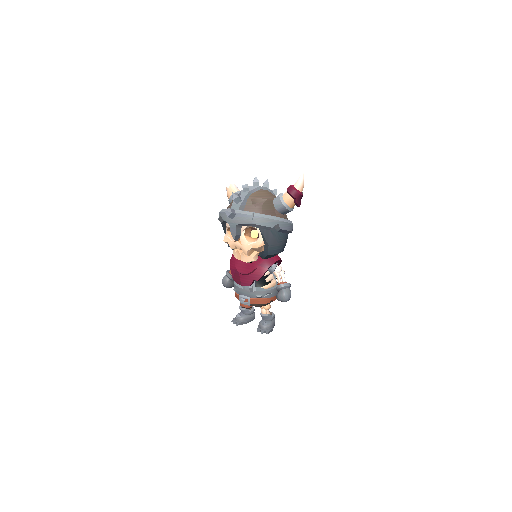 | **Skeleton Warrior** | Undead | 10 | armored, shield + axe |
| 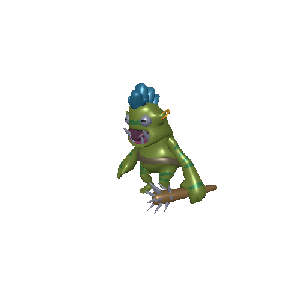 | **Orc** | Brute | 12 | baseline melee |
| 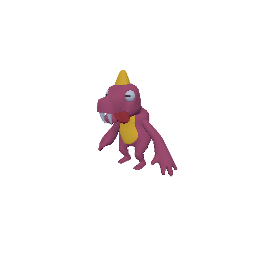 | **Dino** | Brute | 12 | reptile melee |
| 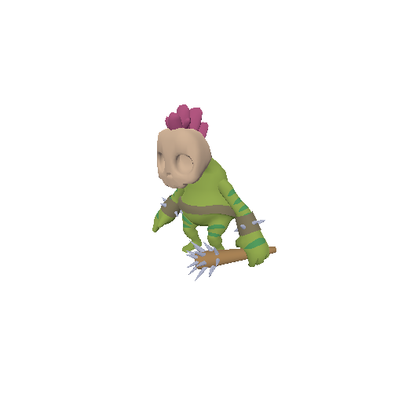 | **Orc Skull** | Brute | 14 | tougher undead orc |
| 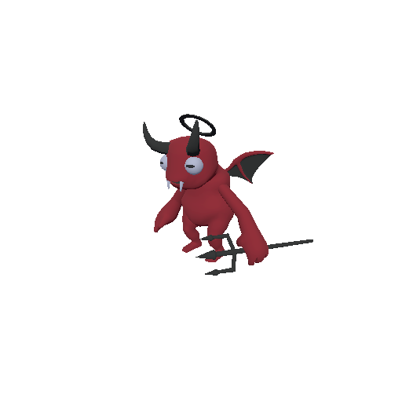 | **Red Demon** | Brute | 16 | heavy hitter |
| 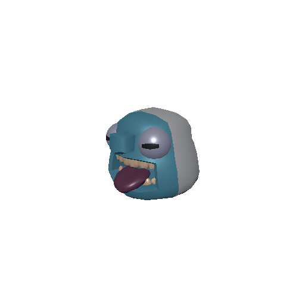 | **Yeti** | Brute | 16 | heavy melee |
| 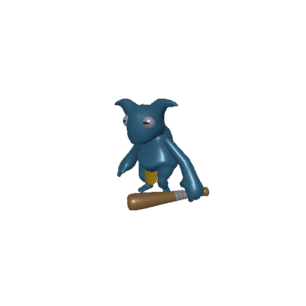 | **Blue Demon** | Brute | 18 | heavy hitter |
| 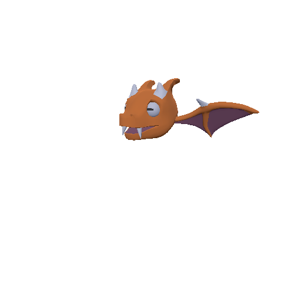 | **Dragon** | Flyer (boss) | 28 | flying mini-boss |
| 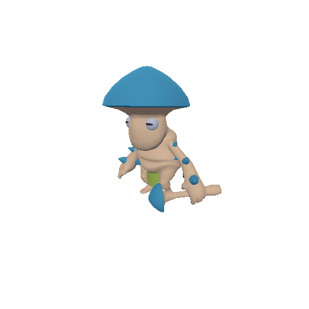 | **Mushroom King** | Brute (boss) | 30 | mini-boss |

> Stats are the current `*_behavior.tres` / `HealthComponent` starting values and are easy to tune.
> Models are CC0 (KayKit + Quaternius — see `assets/ATTRIBUTIONS.json`). Regenerate these images by
> re-running the catalog script after adding/removing monsters.
